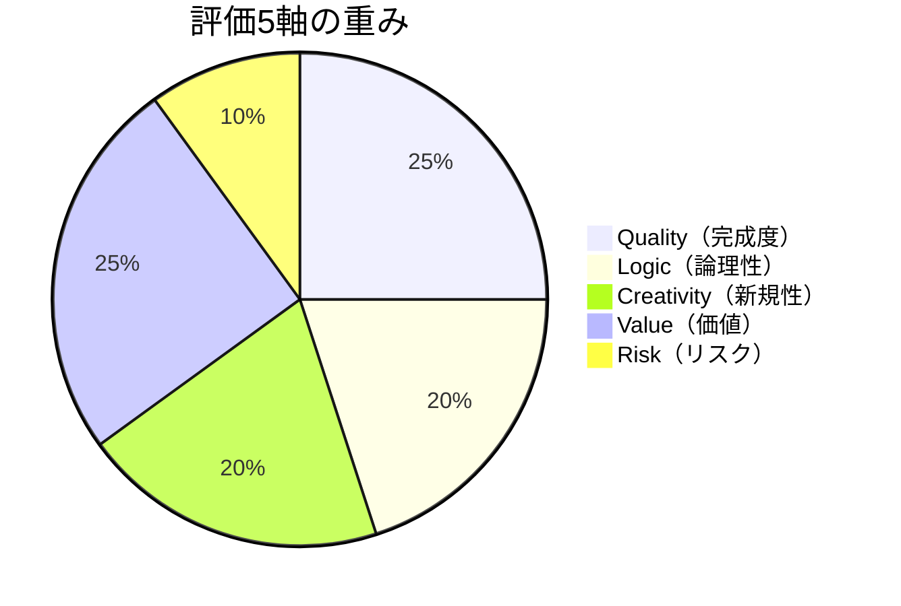

# Insight Synapse
## Canonical Numeric Definitions
### 数値定義書 v0.1（単一正版）

> 本ドキュメントは、Insight Synapse全体で使われる数値（評価スコア・しきい値・算出式）の**単一の正版**を定義する。
> 旧版では各文書が数値を「例」として記述していたが、本版では根拠付きの**既定値**として固定する。
> 各仕様書はこの文書を参照し、数値の再定義は行わない。

---

# 1. 目的と位置づけ

Insight Synapseでは、以下の数値が散在していた。

- 評価の採点基準・合格しきい値・正規化ルール（未定義）
- Confidence / Unknown の算出方法（未定義）
- Cost 式と思考Levelの対応（例止まり・表記揺れ）

本ドキュメントはこれらの**既定値**を一元管理し、検証可能性の基盤とする。

> 数値は「提案」ではなく「規定」である。変更する場合は本文書を改版し、影響を受ける文書に参照を追記する。

---

# 2. 評価5軸（Evaluation）

## 2.1 基本方針

評価は以下の5軸で行う。各軸は0〜1のスケールを取る。

```text
Quality（完成度）
Logic（論理性）
Creativity（新規性）
Value（価値）
Risk（リスク）
```

Riskのみ**低いほど良い**値であり、正規化時に反転する。

## 2.2 既定の重み

```yaml
criteria:
  quality:    0.25
  logic:      0.20
  creativity: 0.20
  value:      0.25
  risk:       0.10
```

### 重みの可視化



重みの合計は1.0。Quality / Value（各0.25）が最も重く、Risk（0.10）が最も軽い。
Riskは「低いほど良い」ため、§2.3で `(1 − risk)` に反転してから重みを掛ける。

## 2.3 Overallスコアの算出式

```text
overall = quality × 0.25
        + logic × 0.20
        + creativity × 0.20
        + value × 0.25
        + (1 − risk) × 0.10
```

Riskは「1 − risk」で反転させてから重みを掛ける。

## 2.4 合格しきい値（既定）

| overall | 判定 | 次の行動 |
|:---:|:---:|:---|
| ≥ 0.70 | 合格（Pass） | 次フェーズへ |
| 0.50〜0.69 | 要改善（Revise） | 改善指示を生成し再制作 |
| < 0.50 | 不合格（Regenerate） | 前提の見直しから再検討 |

## 2.5 採点ルーブリック（各軸の行動的定義）

各軸は「何を観測して何点とするか」を固定する。主観・事例依存を防ぐ。

### Quality

| スコア帯 | 観測できる状態 |
|:---:|:---|
| 0.8〜1.0 | 明確・一貫・使用可能。そのまま実用に耐える |
| 0.5〜0.7 | 構造はあるが、明確性・一貫性に一部欠落 |
| 0.0〜0.4 | 不明瞭・不整合で実用に耐えない |

### Logic

| スコア帯 | 観測できる状態 |
|:---:|:---|
| 0.8〜1.0 | 矛盾なし・根拠あり・因果が説明可能 |
| 0.5〜0.7 | 一部の根拠が不足、または構造の飛躍がある |
| 0.0〜0.4 | 矛盾・根拠欠如で説明不能 |

### Creativity

| スコア帯 | 観測できる状態 |
|:---:|:---|
| 0.8〜1.0 | 既存と明確に異なる・意外性・発展性がある |
| 0.5〜0.7 | 既存の組み合わせだが新規の観点を含む |
| 0.0〜0.4 | 既存の焼き直し、独自性なし |

### Value

| スコア帯 | 観測できる状態 |
|:---:|:---|
| 0.8〜1.0 | 必要性・影響力・継続性が明確に高い |
| 0.5〜0.7 | 必要性はあるが影響範囲・継続性が不確か |
| 0.0〜0.4 | 必要性・影響力が確認できない |

### Risk

| スコア帯 | 観測できる状態 |
|:---:|:---|
| 0.8〜1.0 | 失敗時の影響が大きい・実現可能性が低い |
| 0.5〜0.7 | 部分的にリスク、対策の余地あり |
| 0.0〜0.4 | リスクは限定的・実現可能性が高い |

## 2.6 評価のキャリブレーション

評価者自身の偏りを監査するため、**同一入力を複数回評価**し、スコアの分散を記録する。

- 分散 < 0.05：安定
- 分散 0.05〜0.15：要確認
- 分散 > 0.15：評価基準を再確認

### 評価者の独立性（自己評価の循環の遮断）

AIがAIを評価する**循環**を断つため、以下の独立性対策を義務付ける（POCプロトコルでは `11_実装計画とロードマップ/09_最初の動く試作品設計書.md` §13 に適用）。

```text
1. 盲検化
   評価者は成果物の条件（B0 / B1 / B2 / C1〜C4）を知らされずに採点する

2. 独立評価系統
   処理条件と同系列でない別系統の評価モデルを評価者として用いる

3. 人間較正サンプル（既定: 50件）
   人間が採点した較正サンプルを事前に用意し、評価モデルのスコアを較正する。
   較正サンプル上での人間評価との一致度（スピアマン相関・加重κ係数）を報告する。
   一致度の報告がない限り、成功率を主要評価指標として用いない。
```

### 2.6.1 人間較正サンプルの運用定義（構成概念妥当性）

「人間較正サンプル50件」は§2.6で宣言されているが、その構造は運用定義を欠いている。本節で操作的に定義する。

#### サンプル構造

1サンプルは、タスク・成果物・人間評価の**3点組（タプル）**として定義する。

```yaml
sample:
  task_id: "eval-001"           # タスク識別子
  task:                         # 評価タスク（アイデア評価の設問）
    domain: "AIサービス企画"     # ドメイン（後述の層別）
    prompt: "..."               # 実際の評価設問文
  input:                        # 評価対象の成果物（アイデア評価書）
    artifact_id: "art-001"
    content: "..."              # 成果物の全文
  evaluation:                   # 人間評価者による採点
    evaluator_id: "H-01"        # 評価者識別子
    scores:                     # 評価5軸のスコア（0〜1）
      quality: 0.72
      logic: 0.65
      creativity: 0.58
      value: 0.70
      risk: 0.40
    overall: 0.67               # §2.3の算出式による総合スコア
    rationale: "..."            # 採点理由（自由記述）
```

#### 50件の層別設計

50件は、アイデア評価タスクの現実的な分布を反映するよう**層別抽出**する。

| 層 | ドメイン | 件数 | 理由 |
|:---|:---|:---:|:---|
| A | AIサービス企画 | 15 | POCの主要評価対象ドメイン |
| B | 事業戦略・新規事業 | 15 | 実用性の高い隣接ドメイン |
| C | 技術選定・アーキテクチャ判断 | 10 | 技術的正確性を要するドメイン |
| D | クリエイティブ・制作判断 | 10 | 主観的評価の分散を検証するドメイン |

各層内では、難易度（容易・標準・困難）を均等に割り当てる。これは評価モデルの天井効果・床効果を検出するためである。

#### タスク設計

50件の評価タスクは以下の基準で設計する。

- 実際のAIサービス企画・事業判断・技術選定の現場から抽出した設問を用いる
- 各タスクは「設問 + 成果物（アイデア評価書）+ 評価ルーブリック（§2.5）」の3点セットで構成する
- 成果物は、POCの処理条件（C1〜C4）およびベースライン条件（B0〜B2）と同形式で、人間作成・AI生成・混合を含む（評価者の盲検化を担保するため）
- 成果物の品質は意図的に分散させる（低品質〜高品質の均等分布）

#### 人間評価者プロトコル

- **評価者数**：最低3名（Fleiss κの算出に必要な最小数）。推奨5名
- **評価者要件**：対象ドメインの実務経験3年以上、または評価対象と利害関係のない第三者在席
- **評定スキーマ**：各評価者は同一の§2.5ルーブリック（行動的定義）に従い、5軸を0〜1で独立採点する
- **評価者間信頼性**：Fleiss κ（多人数評価者向け）または ICC（級内相関係数、絶対一致・two-way random model）を算出し、**κ ≥ 0.60 または ICC ≥ 0.70 を最低基準**とする。基準未達の場合は、評価者間キャリブレーション会議を実施し再評定する
- **盲検化**：評価者は成果物が人間作・AI作のいずれか、またどの実験条件に属するかを知らされない

#### 較正手順

人間評価者による50件の採点完了後、以下の手順で評価モデルを較正する。

```text
1. 評価モデルに同一の50件を評価させる（盲検化・独立評価系統の条件下で）
2. 各評価軸について、人間評価（3〜5名の中央値または平均）とモデル評価の
   スピアマン順位相関係数 ρ を算出する
3. overall スコアについて、加重κ係数（二次重み）を算出する
   （合格/要改善/不合格の3値判定との一致度）
4. 軸別の較正結果を報告する：
     ρ ≥ 0.70    → 較正済み（その軸は主要指標として使用可能）
     ρ 0.50〜0.69 → 要観察（補助指標として併記、主要判断には用いない）
     ρ < 0.50    → 較正失敗（その軸での成功率判定は無効。測定方法を再設計）
```

較正が完了するまで、POCの成功率（overall ≥ 0.70）を主要評価指標として用いない。これは§2.6の宣言を運用化したものである。

#### 構成概念妥当性の枠組み

`unknown_level` / `confidence` という中核指標が、測定しようとしている構成概念（**「認知的不確実性の管理能力」**）を実際に測定していることを、以下の3方法で検証する。これは「評価成功率」が思考ではなく成果物を測る間接指標であるという循環性（Wisdom Council評価 v0.4-full の指摘）への回答である。

**収束的妥当性（convergent validity）**：
- `unknown_level` と、人間評価者による「未知の認識不足」評定との相関（ρ ≥ 0.60 を期待）
- `confidence` と、人間評価者による「判断の確信度」評定との相関
- 棄権判断（confidence < 0.3 / unknown_level ≥ 0.7）と、人間評価者による「判断保留すべき」評定の一致率

**弁別的妥当性（discriminant validity）**：
- `unknown_level` と、理論的に独立すべき構成概念（例：文章の流暢さ・文体の美しさ）との相関が低いこと（ρ < 0.30）
- `confidence` と、成果物の長さや形式の整い方との相関が低いこと

**既知グループ妥当性（known-groups validity）**：
- 意図的に「未知の多いタスク」（不確実性を高く設計した設問群）と「既知の多いタスク」（情報を十分に与えた設問群）を較正サンプルに含め、`unknown_level` が前者で有意に高く、後者で有意に低いことを確認する（Mann-Whitney U test, p < 0.05）

これらの検証により、測定の意味（**何を**測っているか）を、数値の正確さ（**どれだけ**正確に測っているか）と同時に担保する。正版は本節である（`06_評価と学習/03` §14 および `11_実装計画とロードマップ/09` §13 は本節を参照する）。

---

# 3. Confidence / Unknown の算出

## 3.1 定義

Stateは以下の2つの量を区別する。

- `unknown`：**質的**。知らない項目のリスト。各項目は「重要度」と「解決状態」を持つ（機構的定義）。
- `unknown_level`：**量的**。未知の度合い（0〜1）。

`unknown` の各項目は、算出をトレーサブルにするため以下の構造を持つ。

```yaml
unknown:
  - item: "市場の前提"        # 未知項目
    importance: 0.8          # 重要度（0〜1）
    status: unresolved       # unresolved / partial / resolved
  - item: "競合の動向"
    importance: 0.6
    status: partial
```

`status` は「未解決 / 部分的解決 / 解決済み」の3値で、`unknown_level` の算出に直接使う。

## 3.2 unknown_level の算出式

```text
unknown_level = 未解決の重要未知項目数 ÷ 重要未知項目総数
```

全項目を同格に扱うのは不適切なため、**重要度で重み付け**する。

```text
unknown_level = Σ(重要度_i × 未解決_i) ÷ Σ(重要度_i)
```

- 重要度_i：各未知項目の重要度（0〜1）
- 未解決_i：未解決なら1、解決済みなら0

## 3.3 confidence の算出式

基本形：

```text
confidence = 1 − unknown_level
```

仮説が存在する場合、仮説の確信度と統合する。

```text
confidence = 0.5 × (1 − unknown_level) + 0.5 × mean(hypotheses.confidence)
```

## 3.4 判断しきい値（既定）

| 状態 | 条件 | 次の行動 |
|:---|:---|:---|
| 探索継続 | unknown_level ≥ 0.6 | Explore / Research を優先 |
| 制作開始 | confidence ≥ 0.75 かつ unknown_level ≤ 0.25 | Create へ |
| 判断保留 | それ以外 | 情報収集・代替案検討 |

## 3.5 棄権機構（判断保留の明示化）

不確実性が高い状態で「推測による判断」を下すことを禁止し、判断を保留して調査行動に回すための機構。

```text
棄権条件（いずれかを満たす場合、判断を下さず明示的に棄権する）：

  - confidence < 0.3
  - unknown_level ≥ 0.7
```

- 棄権時は `judgment = "abstain"` をStateに記録し、代替案の検討・調査を優先する
- 棄権は「無回答」ではなく「保留理由を伴う判断停止」であり、ReasonをStateに残す
- 棄権率（判断を保留したタスクの割合）は評価指標として成功率と併記する
- この数値定義は要因実験H1の操作定義の正版（`11_実装計画とロードマップ/09_最初の動く試作品設計書.md` §12）

---

# 4. Cognitive Cost と思考Level

## 4.1 Cost の算出式（既定）

```text
Cost = Importance × Uncertainty × Impact
```

- Importance：問題の重要度（0〜1）
- Uncertainty：不確実性（0〜1）。Stateの `unknown_level` と一致させる
- Impact：判断結果の影響範囲（0〜1）

## 4.2 思考Level対応（既定）

| Cost | Level | 処理内容 |
|:---|:---:|:---|
| < 0.3 | Level 0〜1 | 即答・簡易分析（Instant Response / Basic Reasoning） |
| 0.3 ≦ Cost < 0.7 | Level 2 | 構造化思考（Structured Thinking） |
| ≥ 0.7 | Level 3〜4 | 深い探索・戦略思考（Deep Reasoning / Strategic Thinking） |

## 4.3 Level定義

| Level | 名称 | 用途 |
|:---:|:---|:---|
| 0 | Instant Response | 単純回答・定型処理 |
| 1 | Basic Reasoning | 一般的判断・軽い分析 |
| 2 | Structured Thinking | 分解・比較・構造的判断 |
| 3 | Deep Reasoning | 重要意思決定・研究・探索 |
| 4 | Strategic Thinking | 長期戦略・複数シナリオ・複数Agent検証 |

---

# 5. 潜在価値モデル

```text
Potential Value = Novelty × Growth × Adaptability × Timing
```

- 各要素は0〜1
- いずれかが低いと全体が急減するため、**積形式**のまま維持する
- 各要素の評定は評価5軸のルーブリックと同様に行動的に行う

---

# 6. 正版参照（各文書への適用）

以下の表記揺れを解決し、正版は本文書と各仕様書の正版に集約する。

| 項目 | 正版 | 参照先 |
|:---|:---|:---|
| リポジトリ構成 | 最終リポジトリ構成仕様書 | `10_環境とリポジトリ/02_最終リポジトリ構成仕様書.md` |
| Primitive分類 | 6カテゴリ×20種、MVP 8種 | `03_コアコンポーネント/03_プリミティブライブラリ設計仕様書.md` |
| 思考Level | 本節4.3 | `03_コアコンポーネント/04_思考コスト管理仕様書.md` |
| Phase（状態段階） | observe → … → improve（小文字） | `03_コアコンポーネント/01_状態モデル仕様書.md` |
| Phase（実行フェーズ） | Observe → … → Reflect（大文字） | `04_スキルとワークフロー/02_ワークフローシステム仕様書.md` |
| unknown / unknown_level | 本節3.1 | 各State・Cost文書 |

---

# 7. 最終定義

Insight Synapse 数値定義書とは、

> 思考・判断・評価・改善の循環を検証可能にするため、評価スコア・しきい値・算出式を「例」から根拠付きの「既定値」へ固定する単一の正版である。

数値は装飾ではない。

数値は、この設計の約束（考え方を自ら改善し続けるAI）を**反証可能にする手段**である。

---

# 8. 実験統計パラメータ（正版）

POC対照実験（`11_実装計画とロードマップ/09_最初の動く試作品設計書.md`）で使用する統計パラメータの**正版**を定義する。各文書はこの数値を再定義せず参照する。

## 8.1 実験パラメータ（既定）

```text
有意水準　　：α = 0.05（片側）
検出力　　　：1 − β = 0.80（β = 0.20）
検定方式　　：二群比率差検定（one-sided）
効果量定義　：成功率の絶対差（percentage point, pp）
             = 処理条件の成功率 − 比較対象（最良）ベースラインの成功率
```

## 8.2 判定基準（既定）

| 効果量（最良ベースライン比） | 判定 |
|:---|:---|
| ≥ 39 pp | **決定的支持**（N=20の検出力で検出可能な範囲） |
| 20〜39 pp | 未確定帯域。§12の事前登録ルールに従い追試を実施し確定 |
| 5〜20 pp | 判定不能帯域。§12の事前登録ルールに従い追試を実施し確定 |
| < 5 pp または低下 | 仮説H棄却 |

## 8.3 追試Nと停止条件（既定）

判定帯域（5〜39pp）に落ちた場合の追試の最小Nは、検出力分析（`11/09` §14）により **N=74/群 以上** とする。

追試ループの停止条件（実験が「決して決着しない」リスクを封印する）：

```text
- 追試は最大1回（初回 + 追試1回の計2回で打ち切り。3回目は実施しない）
- 追試結果 < 5pp   → 棄却を確定（効果なし）
- 追試結果 ≥ 20pp  → 決定的支持を確定（N=74の検出力で20ppを確定）
- 追試結果 5〜20pp → 支持保留（未実証）として最終判定し、実験を終了
```

## 8.4 参照先

- 効果量の操作定義・判定の詳細: `11_実装計画とロードマップ/09_最初の動く試作品設計書.md` §12・§13・§14
- 成功判定に用いる overall しきい値（≥ 0.70）: 本節 §2.4
- 評価者の独立性（盲検化・独立評価系統・人間較正サンプル）: 本節 §2.6、`11/09` §13
- 棄権機構の数値定義（confidence < 0.3 / unknown_level ≥ 0.7）: 本節 §3.5、`11/09` §12 H1
