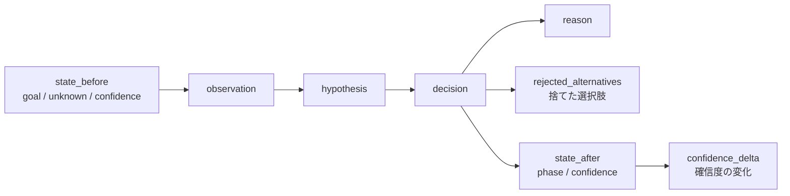

# Insight Synapse
## Memory Architecture Specification
### メモリーアーキテクチャ仕様書 v0.1（統合版）

> 旧版2ファイル（Memory Architecture / Memory System）を統合した版。

---

# 1. 目的

本ドキュメントは、Insight SynapseにおけるMemoryの役割、構造、保存方式、利用方法を定義する。

目的：

> AIの過去情報を保存するだけではなく、思考・判断・改善の軌跡を蓄積し、知的成長につなげる。

---

# 2. 基本思想

一般的なAI Memory：

```text
情報
↓
検索
↓
回答
```

Insight Synapse Memory：

```text
経験
↓
思考
↓
判断
↓
結果
↓
改善
↓
次の判断
```

Insight Synapseでは「思考がどのように変化したか」を保存することを中心とする。

---

# 3. Memoryの定義

Insight SynapseにおけるMemoryとは、

> AIがどのように考え、なぜ判断し、その結果どう改善したかを保存する知的経験データベース

である。

別の表現：

> AIが過去に何を知っていたかではなく、どのように考え、判断し、状態を変化させたかを保存する認知履歴

である。

---

# 4. Memoryの優先順位

保存価値は以下の順番で考える。

```text
1. Thought Trace
    思考軌跡

↓

2. Decision Memory
    判断履歴

↓

3. Pattern Memory
    成功パターン

↓

4. Knowledge Memory
    知識情報
```

---

# 5. Memoryの全体構造

## 4層構造

```text
Memory
├── State Memory
├── Thought Trace Memory
├── Pattern Memory
└── Knowledge Memory
```

## ディレクトリ構造

```text
memory/
├── working/
│   現在思考中
├── traces/
│   思考軌跡
├── decisions/
│   判断履歴
├── patterns/
│   再利用可能なパターン
└── knowledge/
    参照知識
```

---

# 6. Working Memory

## 目的

現在進行中の思考状態を保持する。

対象：

- 現在Goal
- Current State
- Active Question
- 仮説
- 作業中情報

例：

```yaml
working:
  goal: "新規サービス設計"
  current_question: "最適な収益モデルは何か"
  hypothesis:
  - SaaS型が有効
  confidence: 0.6
```

---

# 7. State Memory

## 役割

現在状態を保持する。

保存内容：

- 現在目標
- 進行Phase
- 未解決問題
- Confidence
- Risk

例：

```yaml
state:
  goal: "AI制作基盤設計"
  phase: "architecture"
  confidence: 0.75
  unknown: 0.25
```

---

# 8. Thought Trace Memory

## 最重要Memory（最重要レイヤー）

現在の思考軌跡を保存する。

Thought Traceとは、

> 状態がどのように変化したかを記録した思考ログ

である。

保存するもの：

- 何を考えたか
- なぜそう判断したか（なぜ考えたか）
- 他の選択肢（何を選択したか）
- 迷った点（何を捨てたか）
- 結果（次に何をするか）

形式：

Markdown。

例：

```markdown
# Thought Trace

Date: 2026-08-07

## Initial State

Goal: AI制作システム設計

## Observation

問題: 制作工程が属人的

## Hypothesis

思考工程を分離すれば再利用可能

## Decision

Skill Layerを導入する

## Reason

判断基準を分離できるため

## Next Action

Primitive設計へ進む
```

## 標準交換フォーマット（YAML Schema）

Markdownは人間が読むための記録形式である。一方、**評価データとして相互運用するための標準フォーマット**として、構造化交換形式（YAML / JSON）を定義する。

```yaml
trace:
  id: "trace-2026-08-07-001"
  timestamp: "2026-08-07T12:00:00Z"
  state_before:
    goal: "AI制作システム設計"
    unknown: ["Runtime方式"]
    confidence: 0.4
  observation:
    - "制作工程が属人的"
  hypothesis:
    - "思考工程を分離すれば再利用可能"
  decision: "Skill Layerを導入する"
  reason: "判断基準を分離できるため"
  rejected_alternatives:
    - "単一Agentで対処する"
  state_after:
    phase: "design"
    confidence: 0.7
  confidence_delta: "+0.3"
```

このフォーマットは、**記録形式であると同時に、AI評価・観測性市場の相互運用基盤**である。Runtime（Claude Code等）が変わっても読み替え可能であり、`01_コンセプトと哲学/01` §11 のThought Trace標準フォーマット提案の正版は本節である。

> 本フォーマットの標準化戦略は **standardize-after-prove（実証後に広げる）** に転換された（`01_コンセプトと哲学/01_AI思考アーキテクチャフレームワーク.md` §11「標準化の戦略」を正版とする）。現段階では、本フォーマットはInsight Synapseの内部形式であり、市場への公開資産ではない。Phase 1（単一顧客での実証、`11_実装計画とロードマップ/09`）の完了後に公開段階へ移行する。

### 構造の可視化



判断前の状態（`state_before`）から観測・仮説を経て判断（`decision`）に至り、理由・捨てた選択肢を付記した上で判断後の状態（`state_after`）と確信度の変化（`confidence_delta`）で閉じる、という思考の1区切りの流れを表す。

| フィールド | 内容 |
|:---|:---|
| id / timestamp | 識別子と発生時刻 |
| state_before | 判断前のState（goal / unknown / confidence） |
| observation | 観測した事実 |
| hypothesis | 立てた仮説 |
| decision | 選択した判断 |
| reason | 判断理由 |
| rejected_alternatives | 捨てた選択肢 |
| state_after | 判断後のState |
| confidence_delta | 確信度の変化 |

---

# 9. なぜMarkdownなのか

理由：

## 可読性

人間が読める。

## 編集可能性

AIと人間が共同管理できる。

## Git親和性

変更履歴を管理できる。

## 長期保存性

特定DBに依存しない。

---

# 10. Decision Memory

## 目的

重要な判断を保存する。

保存対象：

- 選択した案
- 却下した案
- 判断理由
- 結果

例：

```yaml
decision:
  question: "Agentは必要か"
  options:
  - Multi Agent
  - Single Agent
  choice: Single Agent + Orchestrator
  reason: 責務分離を優先するため
```

---

# 11. Pattern Memory

## 役割（目的）

繰り返し発生する成功・失敗パターンを保存する。

例：

```markdown
# Pattern

Situation: 新規企画
Problem: 初期探索不足
Solution: Explore Phaseを追加
Result: 品質向上
```

別の表現：

```markdown
# Pattern

名称: 探索不足問題
条件: Unknownが多い
対処: Explore Skillを先に実行
効果: 判断品質向上
```

---

# 12. Knowledge Memory

## 役割（目的）

外部知識（一般知識）を保存する。

対象：

- 技術情報
- リファレンス
- 調査結果

ただし優先度は低い。

理由：

知識そのものより、「知識をどう使ったか」が重要だから。

優先順位：

```text
Thought Trace
>
Pattern
>
Knowledge
```

---

# 13. Memory更新タイミング・書き込みルール

すべてを保存しない。常時保存せず、重要イベント時のみ。

保存条件：

```text
Decision変更
↓
失敗発生
↓
成功発見
↓
新しいPattern発見
↓
Workflow変更
```

書き込みの条件：

## 条件1

判断が変化した。

## 条件2

新しいパターンを発見した。

## 条件3

失敗理由が判明した。

## 条件4

将来再利用価値がある。

---

# 14. Memory読み込みルール

Memoryは大量検索しない。

流れ：

```text
Current State
↓
必要なMemory種類判断
↓
関連Memory検索
↓
Decision補助
```

---

# 15. Memory Pipeline

```text
Execution
↓
Reflection
↓
Insight Extraction
↓
Memory Update
↓
Future Decision
```

---

# 16. Reflection Process

実行後：必ず確認する。

質問：

```text
何が起きたか？
なぜ起きたか？
次回どう変えるか？
```

---

# 17. Memory検索

単純なキーワード検索だけでは不足。

将来：

```text
Semantic Search
↓
Similar Situation
↓
Relevant Pattern
```

を利用する。

---

# 18. Orchestratorとの関係

Orchestrator：「次に何をするか決める」

Memory：「過去の判断経験を提供する」

OrchestratorはMemoryを参照する。

判断：

```text
Current Problem
↓
Past Similar Case
↓
Recommended Action
```

関係：

```text
State
↓
Memory参照
↓
Orchestrator判断
↓
Action
```

---

# 19. Evaluationとの関係

Evaluation結果からMemoryを生成する。

流れ：

```text
Evaluation
↓
Weakness
↓
Pattern
↓
Memory
```

例：

```text
評価
↓
なぜ失敗したか
↓
Pattern化
↓
次回利用
```

---

# 20. Memoryと学習

Insight Synapseでは、Memoryそのものが学習材料になる。

流れ：

```text
Experience
↓
Thought Trace
↓
Pattern抽出
↓
Policy改善
↓
判断能力向上
```

---

# 21. Memory品質管理

Memoryにも評価が必要。

評価基準：

- 再利用性
- 正確性
- 有効性
- 鮮度

---

# 22. Memory肥大化対策

問題：

```text
大量Memory
↓
検索低下
↓
判断低下
```

対策：

## Consolidation

類似Memory統合。

## Abstraction

具体例からPattern化。

## Forgetting

価値低下Memory整理。

---

# 23. Memory Evolution

段階：

```text
Log
↓
Trace
↓
Pattern
↓
Principle
↓
Intelligence
```

---

# 24. Claude Codeとの統合

Claude Codeは第一のアダプタ（Runtime）としてMemoryと統合する。

## コア抽象との分離

Memoryのデータ構造（Thought Traceの標準フォーマット）は**コア抽象**であり、Claude Code固有の表現に依存しない。

```text
コア抽象：Thought Trace標準フォーマット（YAML Schema）・State Schema・Evaluation Schema

アダプタ　：Claude Code（Markdown + YAML + Git + Skillでの保存・操作）
```

Claude CodeはGit履歴を活用する。

役割：

Git：変更履歴
Memory：思考履歴

組み合わせ：

```text
Git Diff
+
Thought Trace
=
進化履歴
```

Runtimeが変わっても、コア抽象として保存されたThought Traceは読み替え可能な形式で維持される。

---

# 25. 設計原則

## 原則1

結果より過程を保存する。

## 原則2

現在の思考状態を最優先する。

## 原則3

Memoryは判断能力向上のために使う。

## 原則4

保存量より再利用性を重視する。

---

# 26. MVP実装

最初はMarkdownベースで実装する。

構成：

```text
memory/
├── current.md（current_state.md）
├── traces/
├── decisions/
└── patterns/
```

不要：

- Vector DB
- Knowledge Graph
- 複雑な検索基盤

---

# 27. 最終アーキテクチャ

```text
Experience
↓
Thought Trace
↓
Pattern Extraction
↓
Memory
↓
Orchestrator
↓
Better Decision
↓
New Experience
```

---

# 28. 最終定義

Insight Synapse Memory Architectureとは、

> AIの過去情報を保存するための記憶ではなく、思考・判断・改善の歴史を蓄積し、未来の知的判断能力を向上させるための経験型メモリーシステムである。

Insight Synapse Memory Systemとは、

> AIが経験した思考過程、判断理由、状態変化を保存し、それを未来の意思決定能力向上につなげるための認知記憶システムである。

Insight SynapseにおけるMemoryとは、単なる情報保存庫ではなく、

**AI自身の思考進化を記録する長期的な認知履歴**

であり、**AIの過去ではなく、AIが成長した証跡そのもの**である。
